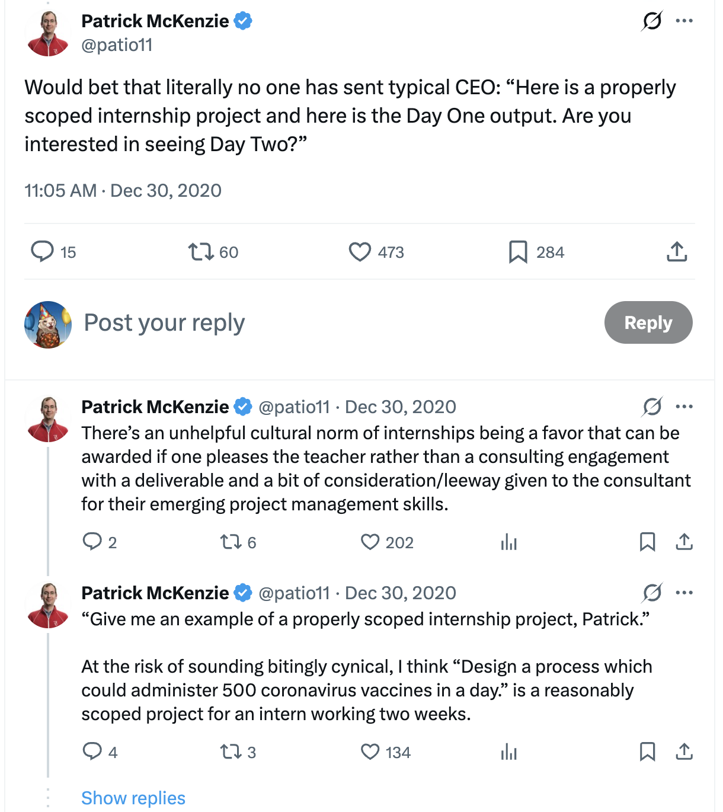
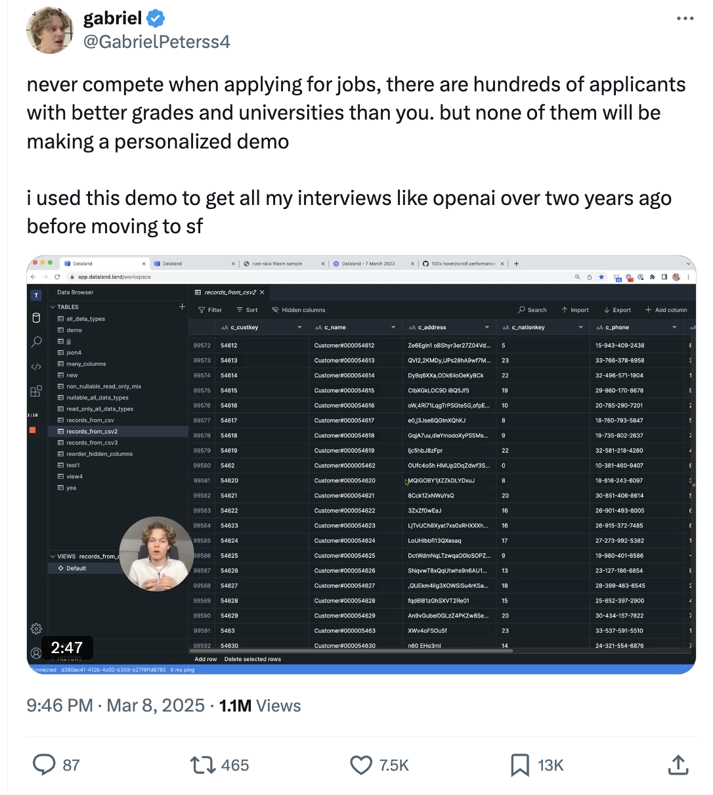

# Spearfishing

## What is Spearfishing?

A spearfish is a highly targeted outreach where you build a small, very relevant, instantly legible demo for one specific company, and then send it to a real decision-maker with a clear ask.

It is not a generic portfolio project, and it is not a random toy that happens to use their API. It is an audition: “here is what it would actually feel like if I worked on your product for a day.”

The demo does **not** need to solve the company’s “real” internal problem. That’s unrealistic from the outside. What it should do is:

- Use their product or APIs, or live directly in their problem space.
- Show that you understand what they are trying to do for their users.
- Be something they would plausibly find interesting, useful, or delightful.

[Source](https://x.com/patio11/status/1344313750334046210)

[Source](https://x.com/GabrielPeterss4/status/1898566138352820561)

## How Hiring Managers See Hiring

On paper, companies are “hiring software engineers.” In reality, they are trying to make scary business problems go away.

The default hiring pipeline (resumes + interviews) is a bad way to do that:

- Resumes are extremely low signal. Two pages of text tells you almost nothing about whether someone can ship useful things.
- Interviews are also noisy and time-consuming. They require context-switching and scheduling, and they still only approximate the work.
- Because both are expensive, companies compensate by cranking the filters:
  - They receive thousands of resumes, and reject 99%+ by default.
  - They over-index on easy filters (pedigree, brand names, keywords).
  - It is completely rational, from their side, to ignore almost everyone.

At the same time, most companies are not “relaxed” about hiring. They are desperate for more signal. They want to be excited about a candidate and feel confident enough to say “yes” quickly. The problem is that any format that would give them more signal (real projects, trials, work samples) is usually a huge ask to make of strangers.

That is the gap spearfishing lives in: you voluntarily give them a much stronger signal than a typical candidate, but only for a small number of companies that you actually care about.

From the company’s point of view, receiving your demo is a huge shock:

- Most applicants barely read the job description.
- Almost no one does meaningful work tailored to their situation.
- It is extremely rare for someone to send them a working prototype that feels like it belongs inside their product or workflow.

## Why Spearfishing Works

From the company’s perspective, a good spearfish answers three questions upfront:

1. **Do you understand what we are building?**  
   You mirror their product, their UX, or their use case in a way that makes sense. You are not just calling an API at random.

2. **Do you behave like someone who can help us?**  
   You picked a target, reasoned about users, made tradeoffs, and shipped something focused. That looks a lot like the real job.

3. **Are you serious enough about us to do real work before we pay you?**  
   You chose them specifically, burned real time on their problem space, and took the social risk of sending it.

It flips their decision from:

> “Will this random resume waste my time?”  

to:

> “Do I want more of the kind of initiative this person just showed me?”

Pre-AI, this would have been hard to recommend. Spending a week or more on each attempt, with no guarantee that anyone would even open your email, is a miserable trade.

Post-AI, the equation is different:

- You already know how to build with AI. You have been doing it for months in the program and during your externship.
- You can turn a well-chosen idea into a convincing demo in hours, not weeks.
- If you are focused and efficient, you can plausibly produce one to three solid spearfish projects in a day.

When you aim carefully in your chosen [lane](../career/lane.md), you do not need a huge hit rate for this to be worth it. Even if only one out of three serious spearfishes turns into a real conversation, that is an extremely good use of your time compared to sending out hundreds of anonymous applications.

A good spearfish:

- Reads like, “I am very specifically interested in *you*, and I took the time to prove it.”
- Demonstrates your abilities in the exact context the company cares about.
- Creates a story that the recipient will remember for years: “Do you remember that person who just built the thing we wanted, without us even asking?”

Spearfishing is a high-context introduction you can create for yourself, on demand.

## Where Spearfishing Works

Whether spearfishing is even *possible* depends on what the person on the other side is allowed to do.

Roughly:

- **Founder at a small company (very early-stage):**
  - Can do almost anything.  
  - Can create roles, design weird internship deals, fast-track someone based purely on a demo.

- **Hiring manager / tech lead at a small or mid-size startup:**
  - Can usually decide *who* to hire.  
  - Cannot always decide *whether* there is a headcount slot at all.  
  - Spearfishes still help a lot, but you are constrained by budget and timing.

- **Manager at a large company with centralized HR (Google, Meta, etc.):**
  - Can almost never bypass the official pipeline, especially for internships.  
  - They might love your demo and still be physically unable to hire you.  
  - In practice, only very senior people can force exceptions, and even that is rare.

So:

- Spearfishing makes the most sense when the person reading your email can realistically say “yes” or at least “let’s talk” and move you forward.
- It is mostly wasted effort on companies where the hiring process is rigid and centralized, especially for junior roles.

## Caveats

Spearfishing is:

- High effort.
- High agency.
- High variance.

You can do everything “right” and still be ignored. That is the game.

That means a few things:

- You should only spearfish companies and demos you are at least somewhat excited about. If it feels like resume spam with extra steps, you are doing it wrong.
- The excitement can be about the product, the problem, the people, or the type of work. You do not have to “love” the company in a spiritual sense, but you should care enough that you want to see this demo exist in the world.
- If you cannot find *any* companies or products that you can muster genuine curiosity or enthusiasm for, that is a separate problem: it might mean you need to rethink your lane, or your relationship to the work, or even whether you want to be in this industry.

Spearfishing should feel like a creative project you are eager to show someone, not like filling out form fields in an applicant tracking system.

## Examples

 - We have a full example of spearfishing ApplyAll [here](https://github.com/fractal-bootcamp/spearfishes/tree/main/applyall).
 - This demo and tweet got Parth (a bootcamp student in our first cohort) an interview with the CEO of Roboflow: https://x.com/mr_samosaman/status/1816172425538625787 
 - The email below resulted in Andrei (a student in Su2025) getting an interview with ElevenLabs, and eventually getting to the final interview. Unfortunately at that point they told him that their head count had changed and all hiring was paused, but this strategy essentially worked.
---
Hi Tanner, 

Thanks again for hosting the FDE event last Tuesday! After speaking with the team, I was really drawn to the culture at ElevenLabs and feel my previous experience aligns closely with what you’re looking for. 

I have a background in VC and PM, most recently at Warner Bros. Discovery and NBCUniversal. I helped start WBD’s APM program and implemented custom AI products at NBCU News Group. Having often been on the receiving end of FDEs and Solutions Engineers, I grew frustrated with slow processes and the lack of learning. I left in May to get closer to building again and am now wrapping up Fractal’s six days a week engineering finishing school. I have experience running FDE-style projects and technical skills. 

As an example, I was interested in your APIs after the event but noticed that text to speech, when sped up, could sound better. I built this little demo (using the v2 model, but v3 seems even cooler) to help me listen to written articles faster: https://smart-speed.vercel.app/ 

You can learn more about my recent projects on my site or LinkedIn. 

I just submitted the interest form and am excited to learn more about the role! 

Best, 
Andrei

---

## Spearfishing Instructions

This is the step-by-step process your workshop will walk through. Each step produces a concrete artifact.

### Step 0: Prerequisites — Lane And Story

Before spearfishing, you need to have a good answer for who you are and what you want. Having a good lane will help filter down the companies you target, so make sure to do the work in [lane.md](lane.md). 

Additionally, your spearfish should say something about who you are and what you're like to work with, which will be much easier if you have a well rehearsed story. Follow the advice in [story.md](story.md) to produce this.

### Step 1: Prospecting

Your first move is not to “cover the whole market.” You only need a small set of companies where a spearfish would feel worth the effort.

By the end of this step, you should have a list of **3–10 companies** that meet these conditions:

- You can imagine being at least somewhat excited to work on their product.
- You can imagine building *some kind* of demo for them.
- They are not so large and rigid that no one can act on your email.
- There is at least a weak signal that they hire engineers right now.

You can find candidates from many places. Common sources:

- **People you have met.**  
  Founders, engineers, or operators you talked to at meetups, hackathons, Fractal events, etc. If the conversation stuck with you, that company is a candidate.

- **Products you already use.**  
  Tools, apps, games, or APIs you touch regularly and have opinions about. Being a real user gives you immediate ideas for realistic demos.

- **Spaces and problems you care about.**  
  Domains where you feel genuine curiosity (games, dev tools, education, creator tools, etc.). Look for startups in those spaces whose product you can actually understand from the outside.

- **Curated job boards.**  
  Smaller or more focused boards (YC, “Made in New York”, niche startup boards). If a company is hiring for a role that matches your lane, a strong spearfish can plausibly bypass their resume queue.

Once you have a rough list, apply a quick filter:

- Would I be willing to spend a full day building a demo for this company?
- Can I think of at least one plausible angle for a demo here?
- Is this company small and flexible enough that a real person could act on my email?
- Are they hiring, or at least clearly trying to grow?

If the honest answer to those questions is “no”, remove that company from your spearfish list. You are aiming for a **short, honest list**, not a comprehensive one.

---

### Step 2: Brainstorming

You do not pick a company in a vacuum. The choice only makes sense once you have thought about **what kind of demo you could realistically build** for each candidate.

For this step, you:

1. Take your short list from Step 1 (ideally 3–5 companies).
2. For each company, sketch one or two **demo ideas** that:
   - You could build in about a day, using technologies you already know.
   - Would be clearly understandable in 30–60 seconds.
   - Are obviously connected to their product, users, or problem space.

You do not need a full spec here. You only need rough shapes, like:

- “A small tool on top of their API that does X for Y kind of user.”
- “A simplified and improved version of their current onboarding flow.”
- “A tiny companion app that shows a fresh, interesting way to use their product.”

As you do this, keep the constraints of a good spearfish demo in mind:

- It must be small enough to build fast.
- It must be instantly legible to someone who has never seen it before.
- It must clearly be related to *this* company.

Once you have a couple of candidate demo ideas per company, pick the **strongest company + demo pair**:

- The demo idea that feels most compelling and concrete to you.
- At a company where you would have some fun working.
- Where you can see a clear story from your lane and portfolio to this work.

That company and demo become the focus for the rest of the pipeline.

---

### Step 3: Spec The Demo

This step is where you decide exactly what someone will see and understand in the first 30–60 seconds of using your demo.

The 60-second constraint matters for two reasons:

- From their side: they do not owe you more than a minute of attention.
- From your side: spearfishing is a probabilistic game. You should make several small, real bets, not one gigantic four-week mega-project.

**Goal:** Define a tiny, focused demo that a stranger can understand in under a minute.

**Output:**

- A short written spec containing:
  - Who the demo is for (type of user).
  - What they can do with it.
  - How it relates to the company’s existing product.
- A clear statement like:  
  “A new user lands on this page, clicks once or twice, and sees X happen, which is interesting because Y.”

**Constraints:**

- You should be able to implement the demo in roughly one concentrated day of coding (or over a weekend), using technologies you already know.
- There should be a single “aha” moment: one main thing the demo does that is obvious and memorable.
- The demo must be self-explanatory. You should not rely on a long email, a README, or a ten-minute video to make it understandable.

**Common Traps:**

- Scoping to “half their product” instead of one narrow flow.
- Scoping so small that it feels trivial or cosmetic.
- Designing something that requires a long tutorial to understand.

**How To Think About It:**

- Imagine the hiring manager clicks your link in an email, spends 10 seconds reading the page, and 20 seconds clicking around. What do you want them to see and feel by the end of those 30 seconds?
- Your spec should be specific about screens and actions, not vague about “improving UX” or “making things better.”

---

### Step 4: Build The Demo

Now you actually build the thing. The goal is not to engineer something impressive; the goal is to ship something clear.

The most reliable workflow for this is to produce a very thorough spec with AI help in Step 3, then work with the AI to break down building that into specific, single PRs that a coding agent can one-shot.

**Goal:** Produce a working, hosted demo that looks like something you could reasonably build at work.

**Output:**

- A live URL where the demo is deployed (Vercel, a subdomain on your portfolio site, etc.).
- Optionally, a link to the code repository, but this is secondary.

**Constraints:**

- Use boring, familiar tech. This is not the moment to learn an entirely new stack from scratch.
- The demo must work reliably enough that someone can click into it and see the main interaction without debugging.
- You should not be spending multiple weeks on one spearfish demo. If it is taking that long, you overscoped.

**Common Traps:**

- Getting lost in infrastructure (auth, databases, deployment) when you could fake or stub those parts.
- Polishing minor UI details while the core interaction is still unclear.
- Treating this as a capstone project instead of a small, sharp artifact.

**How To Think About It:**

- Your constraint is clarity and speed, not technical impressiveness.
- It is fine if the code is somewhat messy under the hood, as long as the demo behaves clearly and does not break.

---

### Step 5: Send The Email

The demo is the main show, but the email is how it enters the other person’s world.

**Goal:** Deliver the spearfish to a real human with enough context that they understand what they are looking at and what you are asking for.

**Output:**

- One concise email to a specific person (founder, engineering manager, or similar).

**Constraints:**

- 5-10 sentences total.
- Addressed to a human, not “careers@company.com”.
- Contains:
  - Who you are and why you are writing to *this* company.
  - What you built and how it relates to their product.
  - A link to the demo (and optionally to the code).
  - A clear, modest ask.

**Common Traps:**

- Apologizing excessively (“this is probably dumb, but…”).
- Overhyping (“this will 10x your growth overnight”).
- Ending with a vague closer (“let me know what you think”) rather than a concrete next step.

**Baseline Structure:**

1. **Who you are + why you care.**  
   One or two sentences about your lane and how you relate to their product. 

2. **What you built.**  
   One or two sentences describing the demo at a high level.  
   Example:  
   “Over the weekend I built a small demo that {does X} for {Y type of user}, inspired by {this specific part of your product or onboarding}.”

3. **Link.**  
   One line with the demo link. You can mention how long it takes to understand.  
   Example:  
   “You can try it here: {URL}. It should take about 30–60 seconds to see what it does.”

4. **Ask.**  
   One or two sentences with a clear, respectful ask. Remain flexible; the ask is just to get your foot in the door.
   Examples:
   - “If this seems directionally useful, I’d love to chat about doing more of this as an intern or trial project.”
   - “Even if you are not hiring right now, I’d be very interested in whether this matches any of the problems you are actually seeing.”