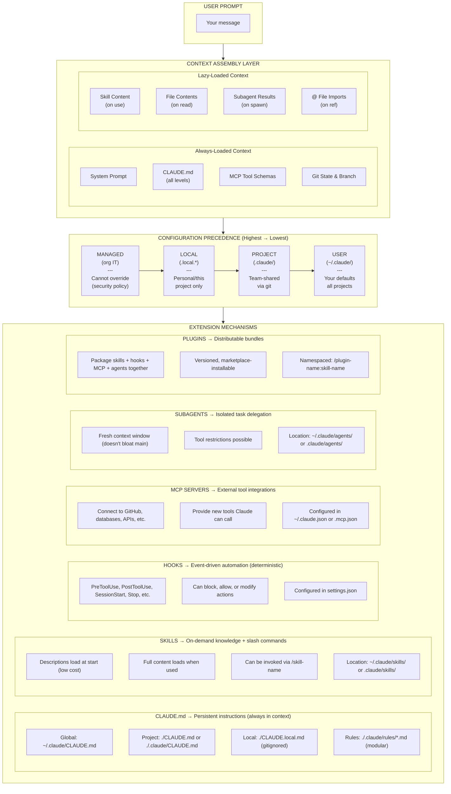
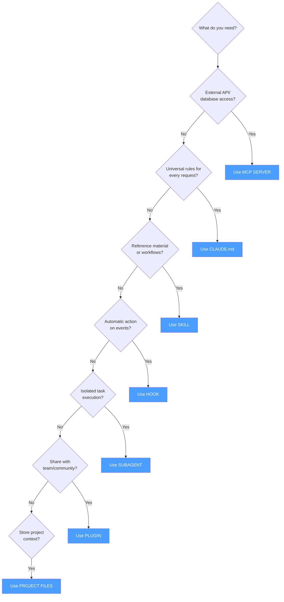

MY PROMPT:
> Can you research and investigate the "correct hierachy" of context
  engineering for Claude Code as a harness? Break down the harness for me,
  and turn it into a system diagram. You can write all this in a
  UNDERSTANDING_HARNESSES.md. Please include every source that you pulled
  from at the top of the file. Some core questions I want you to answer: what
   is the role of CLAUDE.md? what is the role of global vs. project
  configuration? What are all the different parts I can configure? What are
  skills? What are the tradeoffs between Skills and CLAUDE.md files? What are
   plugins? When would I use a plugin, vs a skill, vs a CLAUDE.md? What about
   just storing context in files in the project? When are those files
  referenced, and what is included in context by default when working with
  Claude Code? I really want a COMPLETE guide to Context management in Claude
   Code, and I want you to do a lot of research to answer these questions
  thoroughly, ideally by referring directly to Claude Code documentation,
  written by Anthropic. Anyway, you're always great at tasks like these, so
  I'm sure you'll figure it out. If there any skills that might help you
  improve at tasks like this, please keep a note of that, whether we need to
  develop them ourselves or find them from others. Good luck, let me know
  when you have something for me to review.


# Complete Guide to Context Engineering in Claude Code

> A comprehensive breakdown of how Claude Code manages context, configuration, and extensibility.

---

## Sources

This guide is compiled from official Anthropic Claude Code documentation:

- [Memory Management](https://code.claude.com/docs/en/memory.md) - CLAUDE.md hierarchy and lookup
- [Settings Configuration](https://code.claude.com/docs/en/settings.md) - Configuration scopes and precedence
- [Skills Documentation](https://code.claude.com/docs/en/skills.md) - Creating and using skills
- [Hooks Reference](https://code.claude.com/docs/en/hooks.md) - Event-driven automation
- [Hooks Guide](https://code.claude.com/docs/en/hooks-guide.md) - Practical hook examples
- [MCP Integration](https://code.claude.com/docs/en/mcp.md) - Model Context Protocol servers
- [Plugins Documentation](https://code.claude.com/docs/en/plugins.md) - Creating plugins
- [Plugins Reference](https://code.claude.com/docs/en/plugins-reference.md) - Plugin specifications
- [Subagents Documentation](https://code.claude.com/docs/en/sub-agents.md) - Task delegation
- [How Claude Code Works](https://code.claude.com/docs/en/how-claude-code-works.md) - Context window management
- [Features Overview](https://code.claude.com/docs/en/features-overview.md) - Context costs comparison
- [Best Practices](https://code.claude.com/docs/en/best-practices.md) - Optimization guidelines

---

## System Diagram: Claude Code Context Hierarchy



---

## 1. The Role of CLAUDE.md

### What Is CLAUDE.md?

CLAUDE.md is a **persistent memory file** that Claude reads at the start of every session. It provides context that Claude cannot infer from code alone:

- Build/run commands specific to your project
- Code style rules and conventions
- Testing instructions and preferred runners
- Repository etiquette (branch naming, PR conventions)
- Architectural decisions
- Environment requirements
- Common gotchas and non-obvious behaviors

### Key Characteristic

**CLAUDE.md content is loaded in EVERY request.** This means:
- Instructions persist across the entire conversation
- It consumes context tokens on every API call
- Keep it focused and concise (~500 lines max recommended)
- Only include things that apply broadly to most work

---

## 2. Global vs. Project Configuration

### The Five Memory Locations

| Type | Location | Purpose | Shared With | Priority |
|------|----------|---------|-------------|----------|
| **Managed** | System dirs (org IT controls) | Organization-wide policies | All org users | 1st (Highest) |
| **Local** | `./CLAUDE.local.md` | Personal project overrides | Just you | 2nd |
| **Project** | `./CLAUDE.md` or `./.claude/CLAUDE.md` | Team-shared instructions | Team via git | 3rd |
| **Rules** | `./.claude/rules/*.md` | Modular project rules | Team via git | 3rd |
| **User** | `~/.claude/CLAUDE.md` | Personal defaults | Just you | 4th (Lowest) |

### How Precedence Works

Files are **merged, not replaced**. All applicable files load simultaneously:

1. **Managed policy** - Cannot be overridden (security/compliance)
2. **CLI arguments** - Temporary session overrides
3. **Local scope** - Personal, gitignored
4. **Project scope** - Team-shared
5. **User scope** - Personal defaults

**When instructions conflict:** More specific scope wins. If project denies something user allows, project wins.

### What Goes Where

**Global (`~/.claude/CLAUDE.md`):**
- Personal coding style preferences
- Personal tooling shortcuts
- Your preferred workflows
- Cross-project patterns

**Project (`./CLAUDE.md`):**
- Build commands (`npm run dev`, `make test`)
- Project-specific code style
- Architecture decisions
- Testing instructions
- Repository conventions
- Environment variables

**Local (`./CLAUDE.local.md`):**
- Your sandbox URLs
- Your test data preferences
- Machine-specific configs
- (Automatically gitignored)

---

## 3. All Configurable Parts

### Configuration Files Overview

```
~/.claude/                          # User scope
├── settings.json                   # Global settings
├── CLAUDE.md                       # Global memory
├── keybindings.json               # Key bindings
├── rules/*.md                      # Global rules
├── skills/<name>/SKILL.md         # Personal skills
└── agents/<name>.md               # Personal subagents

.claude/                            # Project scope
├── settings.json                   # Project settings (shared)
├── settings.local.json            # Local settings (gitignored)
├── CLAUDE.md                       # Project memory (alternative location)
├── rules/*.md                      # Modular rules
├── skills/<name>/SKILL.md         # Project skills
└── agents/<name>.md               # Project subagents

./                                  # Project root
├── CLAUDE.md                       # Project memory (primary location)
├── CLAUDE.local.md                # Local memory (gitignored)
├── .mcp.json                       # Project MCP servers
└── .lsp.json                       # Project LSP servers

~/.claude.json                      # User MCP servers
```

### Settings.json Options

```json
{
  "$schema": "https://json.schemastore.org/claude-code-settings.json",

  // Model and behavior
  "model": "claude-sonnet-4-5-20250929",
  "outputStyle": "Explanatory",
  "language": "japanese",
  "alwaysThinkingEnabled": true,

  // Permissions
  "permissions": {
    "allow": ["Bash(npm run *)", "Read(~/.zshrc)"],
    "deny": ["Read(./.env)"],
    "defaultMode": "acceptEdits"
  },

  // Hooks
  "hooks": {
    "PreToolUse": [...],
    "PostToolUse": [...],
    "SessionStart": [...]
  },

  // Environment
  "env": { "NODE_ENV": "development" },

  // Plugins
  "enabledPlugins": { "my-plugin@marketplace": {} }
}
```

---

## 4. What Are Skills?

### Definition

Skills are **markdown files that extend Claude's knowledge and capabilities**. They provide:
- Domain-specific knowledge
- Reusable workflows
- Slash command invocations (`/skill-name`)

### How Skills Work

**Two-phase loading:**
1. **Session start:** Only skill **descriptions** load (low token cost)
2. **When used:** Full **content** loads when:
   - You invoke with `/skill-name`
   - Claude automatically detects relevance

### Skill File Format

```yaml
---
name: explain-code
description: Explains code with diagrams. Use when explaining how code works.
disable-model-invocation: false
user-invocable: true
allowed-tools: Read, Grep
model: opus
context: fork  # Run in isolated subagent
---

When explaining code:
1. Start with an analogy
2. Draw ASCII diagram
3. Walk through step-by-step
4. Highlight gotchas
```

### Skill Locations

| Location | Scope | Priority |
|----------|-------|----------|
| `~/.claude/skills/<name>/SKILL.md` | Personal, all projects | Lower |
| `.claude/skills/<name>/SKILL.md` | Project, team-shared | Higher |
| Plugin skills | Via marketplace | Namespaced |

---

## 5. Skills vs. CLAUDE.md Tradeoffs

| Aspect | CLAUDE.md | Skills |
|--------|-----------|--------|
| **Loading** | Every session, full content | Descriptions only until used |
| **Context cost** | High (every request) | Low (until invoked) |
| **Best for** | Universal rules, conventions | Reference material, workflows |
| **Invocation** | Always active | `/skill-name` or auto-detected |
| **Examples** | "Use Bun not npm", code style | API docs, deployment workflow |

### Decision Guide

**Use CLAUDE.md for:**
- "Always do X" rules
- Build commands
- "Never do Y" prohibitions
- Testing conventions
- Code style rules

**Use Skills for:**
- API documentation
- Code review checklists
- Deployment procedures
- One-off workflows (`/fix-issue`)
- Reference material

**Rule of thumb:** If CLAUDE.md exceeds ~500 lines, move reference content to skills.

---

## 6. What Are Plugins?

### Definition

Plugins are **distributable bundles** that package multiple Claude Code features:
- Skills
- Subagents
- Hooks
- MCP servers
- LSP servers

### Plugin Structure

```
my-plugin/
├── .claude-plugin/
│   └── plugin.json          # Required manifest
├── skills/
│   └── review/SKILL.md
├── agents/
│   └── debugger.md
├── hooks/
│   └── hooks.json
├── .mcp.json                # Optional MCP config
└── README.md
```

### Plugin vs. Skill vs. MCP

| Feature | Purpose | Distribution | Use Case |
|---------|---------|--------------|----------|
| **Skill** | Instructions/workflows | Manual copy | Personal/project use |
| **Plugin** | Bundle of features | Marketplace | Team/community sharing |
| **MCP** | External integrations | Config file | API/database access |

---

## 7. When to Use What

### Decision Tree



### Comparison Table

| Mechanism | When | Example |
|-----------|------|---------|
| **CLAUDE.md** | Universal rules | "Use Bun, not npm" |
| **Skill** | On-demand knowledge | `/deploy` workflow |
| **Hook** | Automatic on events | Format after edit |
| **MCP** | External tools | GitHub, PostgreSQL |
| **Subagent** | Isolated work | Code review agent |
| **Plugin** | Distribution | Team toolkit |
| **Project files** | Codebase context | Architecture docs |

---

## 8. Project Files and Default Context

### What's Automatically Included

**Every session:**
- All applicable CLAUDE.md files (full content)
- MCP server tool schemas
- Git state (branch, uncommitted changes)
- Skill descriptions (not full content)

**On demand:**
- File contents (via Read tool or @ reference)
- Skill full content (when invoked)
- Subagent results (when spawned)

### The @ Syntax

Reference files directly in your prompts:

```
> Explain @src/auth/login.ts
> Compare @package.json with @package-lock.json
> Follow the patterns in @docs/api-conventions.md
```

**What happens:**
- Full file content loads into current message
- CLAUDE.md files from that directory also load
- Directory references show listings (not contents)

### In CLAUDE.md Imports

```markdown
See @README for project overview.
Git workflow: @docs/git-instructions.md
```

These imports load at session start (max 5 hops deep).

### What's NOT Auto-Included

- Individual source files (Claude must read them)
- Documentation files (unless @ referenced)
- Test files (Claude discovers via tools)
- Dependencies (Claude reads package.json)

---

## 9. Context Management

### Context Window Behavior

Claude Code manages context automatically:

1. **Auto-compaction:** When context fills, older tool outputs clear first
2. **Summarization:** Conversation may be summarized if needed
3. **Preservation:** Your requests and key code snippets kept

### Best Practices

1. **Keep CLAUDE.md under ~500 lines**
2. **Move reference material to skills**
3. **Use subagents for investigation-heavy work**
4. **Add "Compact Instructions" section to CLAUDE.md**
5. **Run `/context` to see usage**
6. **Disconnect unused MCP servers**

### Context Costs

| Feature | Cost Per Request |
|---------|------------------|
| CLAUDE.md | High (full file) |
| Skill descriptions | Low (~500 bytes each) |
| Skill content | Zero until used |
| MCP tools | Very high (all schemas) |
| Subagent work | Zero (isolated) |

---

## 10. Practical Examples

### Example 1: New Project Setup

```bash
# Create project memory
cat > CLAUDE.md << 'EOF'
# Project: My App

## Build Commands
- `bun dev` - Start dev server
- `bun test` - Run tests
- `bun lint` - Run linter

## Conventions
- Use TypeScript strict mode
- Prefer functional components
- Use Tailwind for styling

## Architecture
- `/src/components` - React components
- `/src/api` - API routes
- `/src/lib` - Utilities
EOF

# Create personal overrides (gitignored)
cat > CLAUDE.local.md << 'EOF'
# Personal Settings
- My sandbox URL: http://localhost:3001
- Run tests with --watch by default
EOF
```

### Example 2: Team Skill

```bash
mkdir -p .claude/skills/pr-review
cat > .claude/skills/pr-review/SKILL.md << 'EOF'
---
name: pr-review
description: Review pull requests thoroughly
allowed-tools: Read, Grep, Glob, Bash
---

When reviewing PRs:
1. Check for breaking changes
2. Verify test coverage
3. Look for security issues
4. Ensure code style compliance

Use `gh pr diff` to see changes.
EOF
```

### Example 3: Pre-commit Hook

```json
{
  "hooks": {
    "PreToolUse": [
      {
        "matcher": "Bash",
        "hooks": [
          {
            "type": "command",
            "command": "echo 'Validating command...'"
          }
        ]
      }
    ],
    "PostToolUse": [
      {
        "matcher": "Write|Edit",
        "hooks": [
          {
            "type": "command",
            "command": "npx prettier --write \"$FILE_PATH\""
          }
        ]
      }
    ]
  }
}
```

---

## 11. Quick Reference

### File Locations Cheat Sheet

| What | User Location | Project Location |
|------|---------------|------------------|
| Settings | `~/.claude/settings.json` | `.claude/settings.json` |
| Memory | `~/.claude/CLAUDE.md` | `./CLAUDE.md` |
| Rules | `~/.claude/rules/*.md` | `.claude/rules/*.md` |
| Skills | `~/.claude/skills/` | `.claude/skills/` |
| Agents | `~/.claude/agents/` | `.claude/agents/` |
| MCP | `~/.claude.json` | `.mcp.json` |

### Useful Commands

| Command | Purpose |
|---------|---------|
| `/memory` | View loaded CLAUDE.md files |
| `/context` | Check context usage |
| `/mcp` | View MCP servers and costs |
| `/skills` | List available skills |
| `/agents` | Manage subagents |
| `/hooks` | View configured hooks |
| `/init` | Generate starter CLAUDE.md |
| `/compact` | Manually compact context |

---

## 12. Potential Skills to Develop

Based on this research, these skills could be valuable to develop or find:

1. **context-optimizer** - Analyze and optimize CLAUDE.md for token efficiency
2. **skill-generator** - Generate skill templates from descriptions
3. **hook-debugger** - Debug and test hooks before deployment
4. **mcp-discovery** - Find and recommend MCP servers for your stack
5. **project-analyzer** - Generate optimal CLAUDE.md from existing codebase
6. **plugin-scaffolder** - Generate plugin structure from skills

Consider checking the `/find-skills` skill to discover if any of these already exist in the community.

---

## Summary

Claude Code's context engineering follows a **layered architecture**:

1. **CLAUDE.md** - Always-on instructions (use sparingly)
2. **Skills** - On-demand knowledge (prefer for reference material)
3. **Hooks** - Event-driven automation (deterministic rules)
4. **MCP** - External integrations (APIs, databases)
5. **Subagents** - Isolated execution (preserve main context)
6. **Plugins** - Distributable bundles (team sharing)

**Key principle:** More specific configurations override less specific ones. Managed > Local > Project > User.

**Context optimization:** Keep CLAUDE.md lean, use skills for reference material, leverage subagents for verbose work, and monitor with `/context`.
