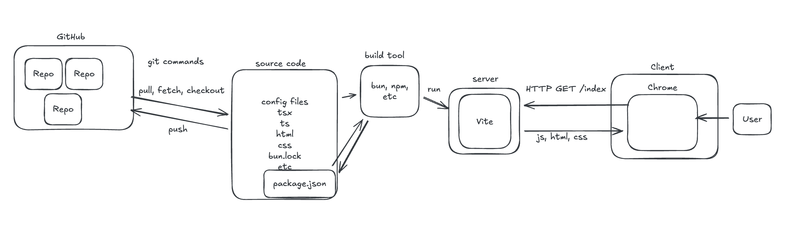

# Simple Game

## Overview

Build Tic Tac Toe from scratch in React. 

If you'd like a challenge or more creativity, you don't _have_ to do Tic Tac Toe. Good contenders for this project are 2-4 player games with simple positional rules and straightforward win conditions, like Connect4, Battleship, or Dots and Boxes. But if you're not confident about your ability to complete the project, do Tic Tac Toe.

## Steps (Morning)

- [Install `git`](https://git-scm.com/downloads/mac) using Homebrew ([install homebrew](https://brew.sh/))
  - What is homebrew...? Ask Claude!
  - What is git...? Ask Claude!
- Fork [this repo](https://github.com/fractal-bootcamp/tic-tac-toe-sp-2026)
  - [What is a fork?](https://stackoverflow.com/questions/24939843/what-does-it-mean-to-fork-on-github)
- Clone repo to your laptop with `git clone`
- [Install bun](https://bun.com/get).
  - What is bun...? Ask Claude!
- Look around the codebase and get familiar with each file
- Take some time to learn about TypeScript
  - Check that you understand every line in `tic-tac-toe.ts`, at least at a basic level
  - [A very effective, 1 hour, video](https://www.youtube.com/watch?v=d56mG7DezGs)
  - [Or, a text based tutorial - get all the way through the "creating types" section](https://learntypescript.dev/01/l1-what-is-ts)
  - Ask Claude to explain specific lines of code to you!
- Switch to a new branch named `add-readme`
- If you are struggling to understand git, please consult these resources:
  - Claude!
  - "Main Levels 1-4" and "Remote Levels 1-6" [here](https://learngitbranching.js.org/?locale=en_US)
  - [Git for ages 4 and up](https://www.youtube.com/watch?v=1ffBJ4sVUb4)
- Use the [`Source Control` side-panel in VSCode](https://code.visualstudio.com/docs/sourcecontrol/overview) to get use Git in a visual way
- Add all files to staging for commit
- Git Commit
- Git push to remote (github)
- Make a PR for `add-readme`
- Merge into branch `main`
- Grab lunch

## Diagram

## Steps (Afternoon)
 - Run `bun test` and notice that all the tests in `tic-tac-toe.test.ts` are failing!
 - Create a new branch called `implement-tic-tac-toe`
 - Implement the functions in `tic-tac-toe.ts` -- work on them until the tests pass
    - Claude can _help you understand_, but do not let it write code for you!!
 - make a PR for `implement-tic-tac-toe` and merge to branch `main`
 - Create a new branch called `display-game`
 - Display the `gameState` variable in `App.tsx` using React
    - Use a [`<Table>`](https://www.w3schools.com/html/html_tables.asp) so the game shows up as a 3 x 3 table
 - Add interactivity; when you click an empty cell, call `makeMove` and update the `gameState`
 - Display the current player and the winner (if there is one) based on the game state
 - When you have an interactive tic-tac-toe that follows all the game rules, you're done!
 - Merge `display-game` into `main` with a PR
 - Don't forget to write in #eod

## Diagram

