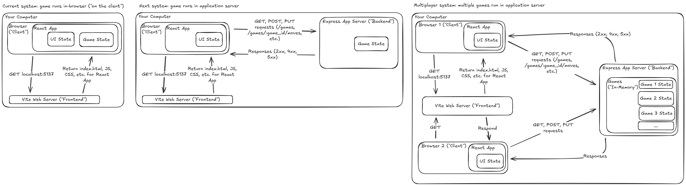

# Tic Tac Toe on a Server

## Overview

Our goal is to make our Tic-Tac-Toe use online multiplayer. Right now, the entire game runs
in each player's browser (aka. "on the client"), making this impossible. By introducing a _server_,
we can make the first step towards managing the game state outside of our clients.

When a player loads the page or makes a move, instead of changing the Tic Tac Toe game state
themselves, they make requests to an Express server, powered by an HTTP API.

## Prework

- (~20 min) [Promises & Asynchronous Programming, from beginning until "Generators" section](https://eloquentjavascript.net/11_async.html)

## Requirements

Your app:

- maintains all the functionality it had in the in-browser version (feel free to add more if you have time).
- runs on a server using `express` and `vite-express`
- `bun dev` runs `bun run --watch server.ts`
- identifies games by their `id`, which uses a [`uuid`](https://www.npmjs.com/package/uuid)
- has a new `interface` called `TicTacToeApi`
  - 3 functions: create a game, make a move, and get a game by ID
  - return `Promise` and use `async/await` as needed
- `TicTacToeApi` has a client implementation that uses [`fetch`](https://developer.mozilla.org/en-US/docs/Web/API/Fetch_API) to communicate with the sever
- Our express server has new routes that receieve requests made
  using `fetch` on the client

### Bonus

- Create an in-memory implementation of `TicTacToeApi` that doesn't make any network requests.
- Add a comprehensive set of tests that runs against this in-memory version of the API.

## Steps (Morning)

- Run `bun create vite-express` and follow the prompts.
- `cd` to your app directory.
- Run `bun install`.
- Run `bun run dev`.
- TODO add more steps
- Lunch

## Steps (Afternoon)

- TODO add steps
- Write EOD update

## Diagram

## References

- [Vite Express Setup](https://github.com/szymmis/vite-express?tab=readme-ov-file#fresh-setup-with-create-vite)

## Inspiration

- [https://playtictactoe.org/](https://playtictactoe.org/)
- [Tetris (Brian Smiley)](https://bs-tetris.netlify.app/)
- [https://kevinshannon.com/connect4/](https://kevinshannon.com/connect4/)
- [https://www.gameaipro.com/](https://www.gameaipro.com/)

## Example Code
