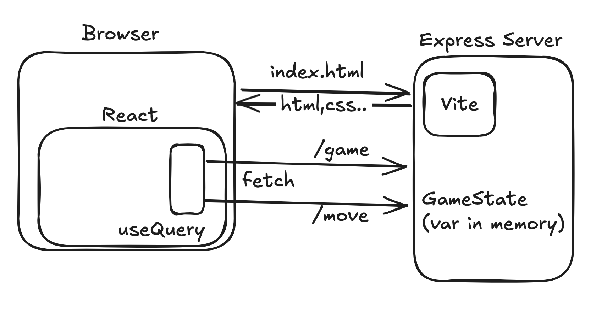
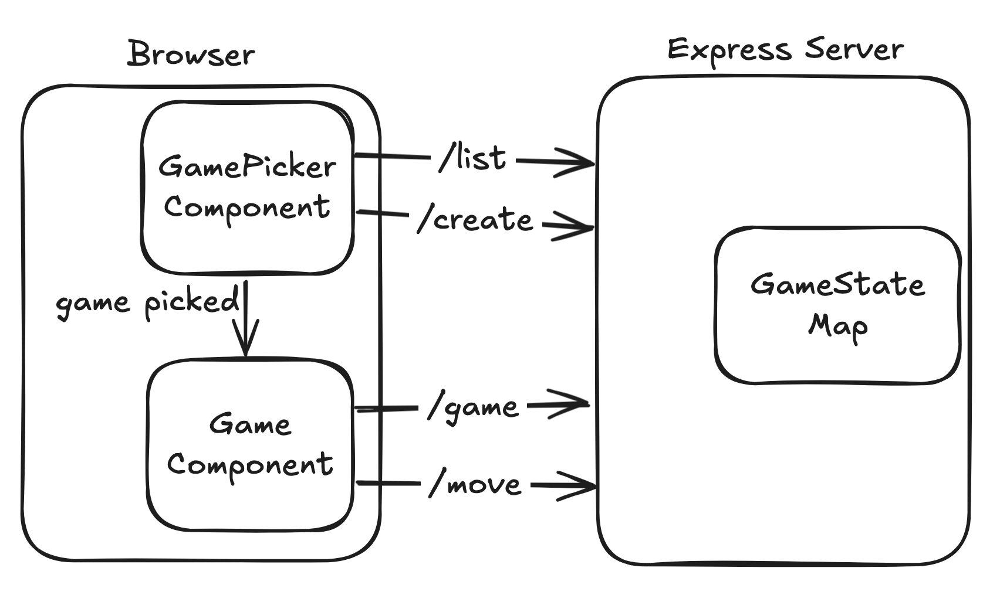

# Tic Tac Toe on a Server

## Overview

Our goal is to make our Tic-Tac-Toe use online multiplayer. Right now, the entire game runs
in each player's browser (aka. "on the client"), making this impossible. By introducing a _server_,
we can make the first step towards managing the game state outside of our clients.

When a player loads the page or makes a move, instead of changing the Tic Tac Toe game state
themselves, they make requests to an Express server, powered by an HTTP API.

## Pre-work

- (~20 min) [Promises & Asynchronous Programming, from beginning until "Generators" section](https://eloquentjavascript.net/11_async.html)
- (~20 min) [React Query Docs](https://tanstack.com/query/latest/docs/framework/react/overview)

## Steps (Morning)
 - Set up [Vite-Express](https://github.com/szymmis/vite-express?tab=readme-ov-file#fresh-setup-with-create-vite) on your existing tic-tac-toe app
 - Modify `bun run dev` to run `server.ts`
 - Add a `/game` (GET) and `/move` (POST) endpoints
 - call `makeMove` in the server, manage the game state in-memory
 - Use React Query and `fetch` to read and write game data via a server
 - Goal State:
   - your game has identical functionality, but all game state is managed by the server
   - game state persists if you refresh the tab, but not if you restart the server

## Diagram

¡
## Steps (Afternoon)
 - Now we need to support multiple games.
 - Add game ID to the `GameState` model
 - Add game ID to `/game` and `/move`
 - Add a list of games: GET `/games` and a create game endpoint: `/create`
 - Now we need to allow a user to pick a game:
    - Add a new "pick/create game" component that displays initially
    - Once a game ID is selected, display the normal tic-tac-toe component
 - Goal State:
    - your game allows users to join an existing game or start a new one
    - each tic-tac-toe game functions as normal (detects winners, ties, etc.)
    - states persist between chrome tab refreshes, but not server restarts

## Diagram

## Example Code

[Step 1](https://github.com/fractal-bootcamp/tic-tac-toe-fa-2025/pull/1)
[Step 2](https://github.com/fractal-bootcamp/tic-tac-toe-fa-2025/pull/2)