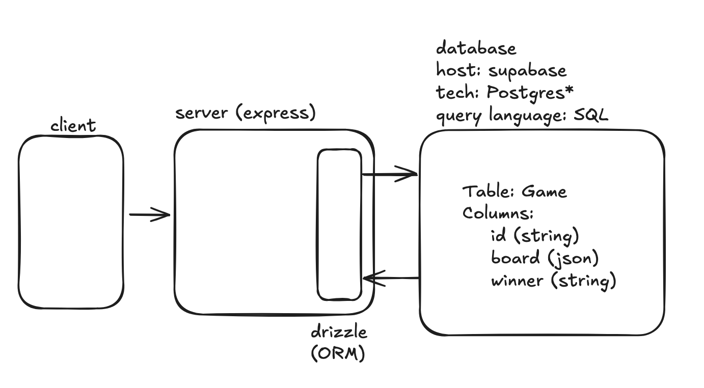

# Databases

## [Repo Link](https://github.com/fractal-bootcamp/assignment-3-databases)

## Overview

By the end of this assignment, our tic-tac-toe app will be functionally identical,
but the game state will be managed in a database, rather than in-memory in our server.

This means we can freely restart the server, and tic-tac-toe state will be maintained.

## Pre-Work
- (~10 min) [What is a database?](https://www.whalesync.com/blog/an-intro-to-databases)
    - You can ignore the stuff about Whalesync, but we are going to use Supabase!
- (~1 hour) Learn basic SQL by completing [Chapter 1 and 2 here.](https://www.executeprogram.com/courses/sql).
- (~10 min) Read about [Drizzle](https://orm.drizzle.team/docs/overview)

## Steps

 - To host our database, we will use [Supabase](https://supabase.com). It runs Postgres servers, and it's free(!)
 - Create a Supabase project (make sure to save off the URL and password -- the password will only appear once)
 - We will use Drizzle to connect to our supabase project.
    - Why use Drizzle and not raw SQL clients and SQL directly?
    - Follow [the guide](https://orm.drizzle.team/docs/get-started/supabase-new) to set up Drizzle and Supabase
 - Make a `schema.ts` for your tic-tac-toe table
 - Push it to your database with `bun drizzle-kit generate` and `bun drizzle-kit migrate`
 - Replace the logic in `/game`, `/move`, etc. so instead of writing to an in-memory store, you use Drizzle
 - Observe that your games persist even if you restart your server!

# Diagram

