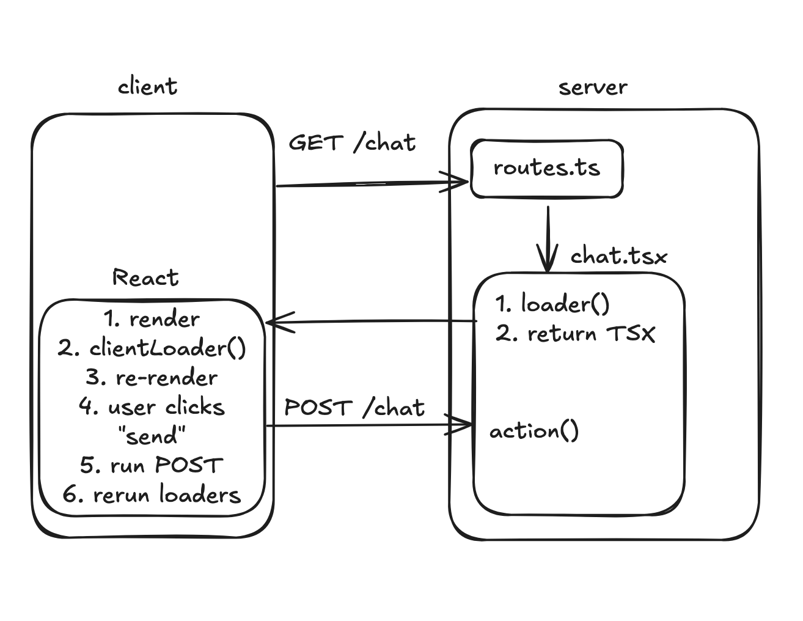
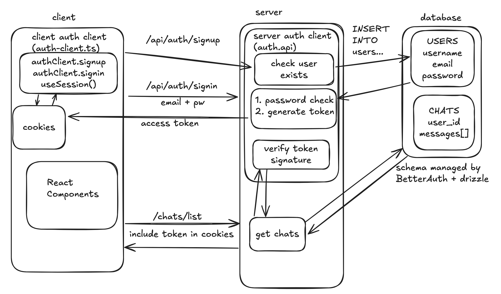

# AI Chatbot

## Overview

This week we're going to build a clone of [chatgpt.com](http://chatgpt.com). It will have
 - A nice chat UI for talking to a model
 - Real-time streaming of AI responses
 - Multiple chats
 - Login (with Google, Github, etc)
 - (Optional) Cool features like search or tool calls (e.g. "get the weather" or "add to my todo list")

I strongly encourage you to make it your own. By using custom prompts and tool calls,
we can make the LLM highly customized. This will make your demo much more fun!
Previous cohorts have have made:
 - a movie recommender bot that remembers past conversations
 - a site that personifies your astrological signs so you can talk to them
 - a trivia game where you talk to characters to learn about new york city
 - a recipes app where the AI can save/generate recipes for you

## Pre-Work

 - [Data vs. State -- The Two Reacts](https://overreacted.io/the-two-reacts/)
 - [Impossible Components](https://overreacted.io/impossible-components/)
  <sub>Note: If these are confusing, also try this talk by Dan Abramov called [React for Two Computers](https://www.youtube.com/watch?v=ozI4V_29fj4&t=2s)</sub>
 - (1 hour) [React Router Framework Tutorial](https://reactrouter.com/tutorials/address-book)
    - If you follow the tutorial closely, you may not need to actually _do_ the tutorial
    - No need to read every word -- spend time on the features that seem relevant to you
    - [Video](https://www.youtube.com/watch?v=pw8FAg07kdo) if you must
 - (10 min) [Intro to JWTs](https://www.youtube.com/watch?v=Y2H3DXDeS3Q)
    - JWTs are the way we will authenticate users in our app!

## Today's Assignment

For today, we have two goals:
 - set up and understand React Router
 - understand authorization and authentication and build it into our app

By the end of the day you should have a React Router app that has a login page
and a page that displays `Hello, {email}!` once the user logs in.

This is deceptively difficult! We need to build:
 - A login page
 - A signup page
 - Store user data permanently in a database with a schema
 - Add logic to make sure users can't access data they're not supposed to
 - Some way to identify users who make random requests to our website

Given how hard and sensitive these problems are, we won't be buliding it from scratch.
We will use an auth framework to do most of the heavy lifting for us.

## Lecture Notes

 - Explain architecture of React Router in a high-level conceptual way
 - Talk about authentication / authorization from first principles
 - Talk about what BetterAuth does for us exactly

## Diagram




## Steps

Remember, the goal is **not to copy and paste**. Blindly copying and pasting will keep you from understanding what is going on. 
Make sure you understand every piece of the diagram above. At this point, what we're installing is complex enough that it won't
work exactly right by default, and blindly listening to the AI or red squiggles without a clear understanding of the systems 
at play will lead you down a rabbit hole. Get conceptual understanding of each step first, ideally by asking an LLM.

 - Install React Router: `bun create react-router@latest .`
 - Set up Drizzle and a `db` instance
 - Install Better Auth
    - Complete steps 1-6 [here](https://www.better-auth.com/docs/installation)
    - We use the [drizzle adapter](https://www.better-auth.com/docs/adapters/drizzle) and [email & password](https://www.better-auth.com/docs/authentication/email-password) configuration:
```
import { db } from "./db/db";

export const auth = betterAuth({
    emailAndPassword: { 
        enabled: true, 
    }, 
    database: drizzleAdapter(db, {
        provider: "pg", // or "pg" or "mysql"
    }),
})
```
 - Step 5: we will use Drizzle to manage our database schema. After, you should have a `user` table (and a few others) in Supabase.
```
bunx @better-auth/cli@latest generate
bun drizzle-kit generate # generate the migration file
bun drizzle-kit migrate # apply the migration
```
 - For step 7, we need to wire Better Auth into React Router
    - "Remix" is the old name for React Router, use that variation. More details [here](https://www.better-auth.com/docs/integrations/remix)
    - Add the `/api/auth/*` route to `routes.ts`: `route("api/auth/*", "routes/api.auth.$.ts")`
        - check your understanding - what is this? why do we need it?
        - this is important but mysteriously missing from the guide above...
 - Step 8 gives us something we can use in our react components!
 - Build signin/signup components using the `authClient.signIn.email()` and `authClient.signUp.email()` functions (see example code below)
 - Build a simple sign-in component:
 ```
 export default function Home() {
  const { data, isPending, error } = authClient.useSession()
  if (data) {
    return <div>Hello, {data.user.email}!</div>
  } else {
    return <div>
      <SignIn />
      <SignUp />
    </div>
  }
}
```
 - If you can see `Hello {email}`, you got everything working!
 - Protect your "Hello {email}" page with a redirect to a separate `/signin` page if they aren't logged in

## Optional Extras

 - Start thinking about how to customize this
 - Get [Signup with Google](https://www.better-auth.com/docs/authentication/google) working
 - Protect "Hello {email}" at the server level; even trying to GET or POST to this page should return a 301 redirect when logged out
    - See `/protected` in the example code for detail

## Example Code

[PR](https://github.com/fractal-bootcamp/chatbot-react-router/pull/1)