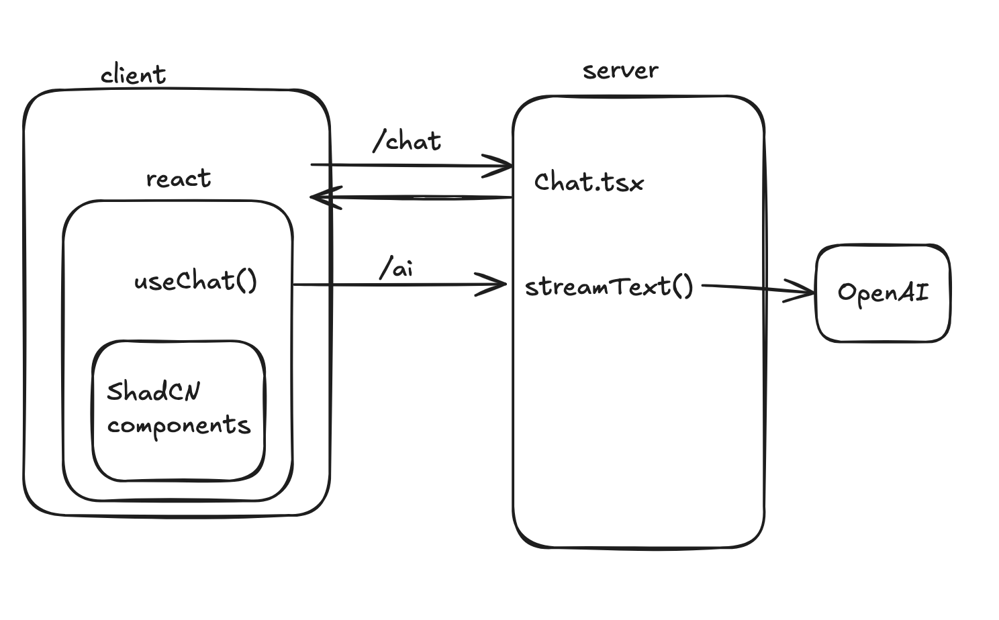

# AI Chatbot: A Single Chat

## Overview

Today, we are going to use the Vercel AI SDK to make a single page where
we can chat with an AI model of our choice. We will have a single 
page, `/chat`, protected by a login page. The chat does not need to persist
between sessions. The page should be nicely styled using ShadCN.

## Pre-Work

 - [Freedom and Responsibility Culture](https://igormroz.com/documents/netflix_culture.pdf)
 - Read the [Foundations](https://ai-sdk.dev/docs/foundations) and [Core Features](https://ai-sdk.dev/docs/ai-sdk-core/overview) of the Vercel AI SDK
 - Learn about [ShadCN](https://ui.shadcn.com/docs)
    - You should be able to clearly answer the question "What is ShadCN and why is it useful to us?"
    - Hint: it is NOT a component library

## Lecture Notes
 - Explain what ShadCN is
 - Explain useChat() and streams

## Diagram

## Steps

 - Most of this day is fairly well explained by [this tutorial](https://ai-sdk.dev/docs/getting-started/nextjs-app-router), but it's for Next.js
    - It's a similar architecture, and some of the components can be copy/pasted
    - But don't do it blindly! There's many React Router-specific translations we will have to do
    - Use the example code if you get lost
 - [Install dependencies and an AI provider](https://ai-sdk.dev/docs/getting-started/nextjs-app-router#install-dependencies)
    - I chose [OpenAI](https://ai-sdk.dev/providers/ai-sdk-providers/openai)
    - you will need to create a developer account and get an API key with your provider
 - For the [Create Route Handler](https://ai-sdk.dev/docs/getting-started/nextjs-app-router#create-a-route-handler) step:
    - We're not using Next.JS. How can we accomplish a functionally identical thing? Think deeply about this and compare you solution to mine:
    - Create a custom route like `ai.tsx` and add it to `routers.ts`
    - Fill in `export async function action({ request }: Route.ActionArgs) {` with a similar `streamText` implementation to the tutorial
    - POST `/ai` should call this function
 - [Wire up your UI to `useChat`](https://ai-sdk.dev/docs/getting-started/nextjs-app-router#wire-up-the-ui)
 - Get the AI to use a single tool, perhaps [to get the weather](https://ai-sdk.dev/docs/ai-sdk-core/tools-and-tool-calling)
 - [Install a button via shadcn](https://ui.shadcn.com/docs/installation)
 - Peruse a list of component libraries that use ShadCN [here](https://github.com/birobirobiro/awesome-shadcn-ui) and pick one you'd like to use or modify for your project
 - Re-style your chat page using your fancy pretty shadcn components
 - Protect `/chat` behind a login of some kind. Don't forget that `POST /chat` should be protected too!

## Optional Extras

 - Start evolving your project into something exciting to demo!
 - Add even more styling
 - Add more tool calls
 - Set up a cool custom [prompt](https://ai-sdk.dev/docs/ai-sdk-core/prompt-engineering)

## Example Code

[PR](https://github.com/fractal-bootcamp/chatbot-react-router/pull/2)