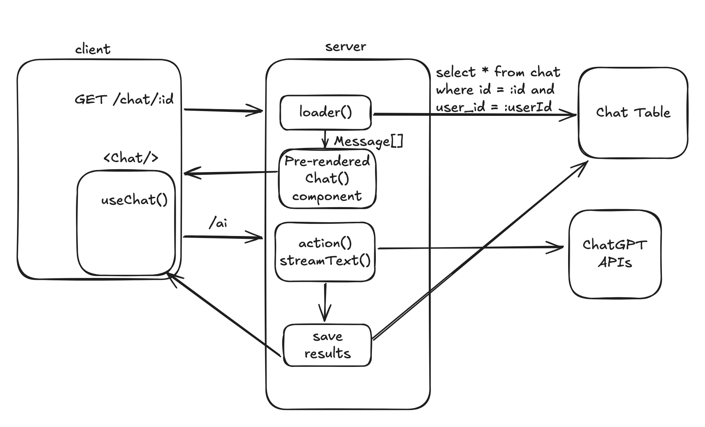

# AI Chatbot: Persistence + Multiple Chats

## Overview

Today, we are going to support storing and listing multiple chats for a single user.
By the end of the day, we should have a very bare-bones clone of ChatGPT, with:

 - A sidebar with a list of chats and a "new chat" button
 - Different chats accessible by ID, e.g. `/chat/{id}`
 - Users don't see each other's chats
 - Chats are saved between sessions

## Pre-Work

 - [Ch3. Data, Actions, Calculations](https://drive.google.com/file/d/1NQ3CXC1cPlgdoegeCbA01tGUWVUDPbqA/view)
 - [Copy What You Like](https://paulgraham.com/copy.html)

## Diagram

## Steps

 - Create a table and schema for each chat
    - This is a bit tricky. What _is_ a chat? What can it contain?
    - One trick to help modeling: figure out exactly how you need to read/write data to your database. Write those functions first
    - Should you store each chat as a single row? Or perhaps each message has its own row? What's the tradeoff?
 - Set up your database functions: create/read/update/list chats
 - Add a "Create Chat" button that creates a new chat and redirects to `/chat/{newId}`
 - [Set up message persistence](https://ai-sdk.dev/docs/ai-sdk-ui/chatbot-message-persistence)
    - This tutorial has good _ideas_ but you shouldn't follow it line for line at all times
 - Add a chat sidebar that lists all the chats

## Lecture Notes

 - Chat modelling exercise
 - Order of implementing things. What should go first?

## Example Code

[PR](https://github.com/fractal-bootcamp/chatbot-react-router/pull/3)