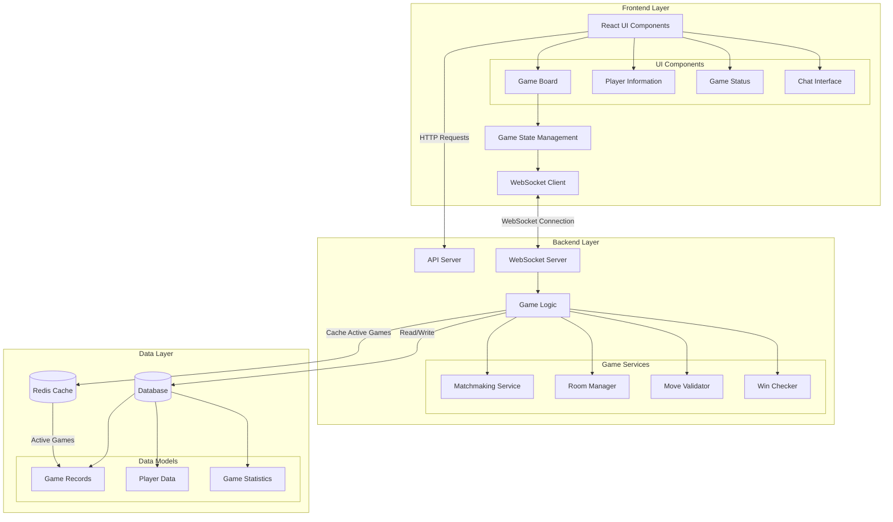
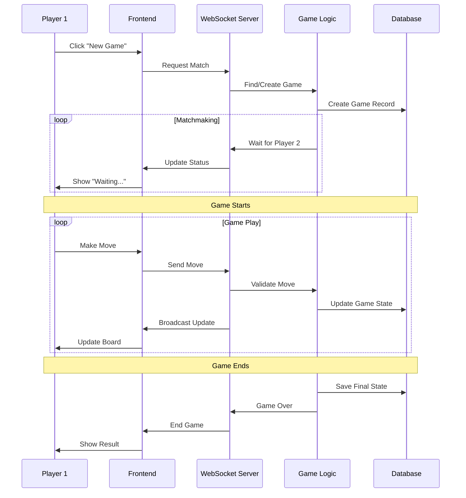

# Team Development Workflow Guide

## Overview
This guide establishes a clear workflow for teams working in shared repositories at high velocity, with multiple integrations per day and immediate collaboration needs.

## Core Structure

### 1. Establish Head of Engineering Role
**The Head of Engineering is responsible for:**
- Enforcing code structure, style guide, and architecture
- Reviewing every PR before merge
- Managing all integration steps throughout the day
- Managing system rewrites and major architectural changes
- Holding the complete system design in their head

**How to choose:** Select the team member who can make fastest architectural decisions and can context-switch rapidly between different parts of the system, not necessarily the most senior engineer.

### 2. Initial Setup Process

#### Step 1: System Architecture
**Goal:** Create a shared understanding of how the system works - completed in first 2 hours

**How to do it:**
- Use a shared screen/projector with the whole team present
- Start with high-level components and drill down live
- Draw directly in code comments or a shared whiteboard tool
- Make decisions immediately - no extended discussion

**Example System Diagram (done live, in 30 minutes):**



### And here's a sequence diagram for the app flow



**Document it as:**
- Comments at the top of main files explaining their role
- A single README.md with ASCII diagram and mermaid diagrams
- Verbal explanations during the session (no lengthy documentation)

#### Step 2: API Definition
**Goal:** Define contracts in real-time as you code

An API is any interface between one piece of code and another.

Realistically, you can identify APIs in your Typescript code via `import` and `export`.
Any code which is exported is intended to be used as a "module", so is an API.

Changing APIs is a BIG DEAL. Other developers are probably using that API, and not just in Main. They might be modifying that API in their pull request. They might be relying on that API in their pull request.

Changing APIs is the #1 cause of Merge Conflicts and Bugs.

You can limit the number of bugs by keeping API changes minimal, modular, isolated, and tested.

**Some Heuristics for changing APIs:**
1. Don't PR a change to an API with any other changes to any other part of the code (use `git town prepend` if you're in the middle of a feature and need an API change)
2. Don't change APIs without tests
3. Don't change APIs without telling the relevant people on your team (link your tiny PR that changes the API!)
4. Don't break any existing code that relies on the API!!

**Further thoughts on setting up APIs in a group project:**
- Head of Engineering defines (or confirms) API signatures in TypeScript interfaces
- APIs are defined and stubbed/mocked as soon as we know they are needed. But remember [YAGNI](https://martinfowler.com/bliki/Yagni.html)
- Use TypeScript/type hints to enforce contracts
- If you need to change an existing exported type to support a feature, decouple that change from your feature and ship it ASAP (eg. `git town prepend`)
- Message the team and the EM immediately that you are changing the contract for that part of the code.
- Any code that is IMPORTED or EXPORTED is an API.
- Limit the amount of code that you export.
- Limit APIs
- If you ever need to change code which is exported (eg an API), make that change quickly and modularly, with a minimal pull request; use `git town prepend`


**Example API Mock/Stub Definition:**
```typescript
// types/api.ts - updated throughout the day
interface LoginRequest {
  email: string;
  password: string;
}

interface LoginResponse {
  token: string;
  user: User;
}

// API contract defined at function signature
async function loginUser(req: LoginRequest): Promise<LoginResponse>
```

**Where and How you Expose APIs is Very Important!!:**
1. Any new data types should be added or changed as soon as you need it
2. Use `git town prepend` to decouple data and type and interface changes from feature/logic changes which rely on that data or those types or those interfaces
3. Head of Engineering should confirm and merge new interface changes quickly
4. Locate data and types where they will be used. If they will be used globally across the app, consider a base-level `shared` directory so people are scared to change them. If they will only ever be used locally and not exported at all, just define them inline in the file where they are used. Keep shared code to an absolute minimum. Keep exports to a minimum. Keep APIs to a minimum, they create complexity.

#### Step 3: End-to-End Scaffolding
**Goal:** Create working skeleton in first hour, expand throughout the day

**How to do it:**
- Head of Engineering live-codes the basic app structure with team
- Create minimal implementations (or stubs) that return hardcoded data (or stubs)
- Each team member immediately starts replacing stubs in parallel
- Integration happens continuously throughout the day


**Example Scaffolding (written in 20 minutes):**
```javascript
// API stubs - replaced throughout the day
export const userAPI = {
  login: async (email, password) => ({ token: 'temp', user: { id: 1, email } }),
  profile: async (token) => ({ name: 'Test User', email: 'test@example.com' }),
  // TODO: Sarah working on login, Mike working on profile
};

// Frontend stubs - replaced in parallel
function LoginForm() {
  const handleSubmit = async (email, password) => {
    const result = await userAPI.login(email, password);
    setToken(result.token);
    navigate('/dashboard');
  };
  return <form onSubmit={handleSubmit}>/* basic form */</form>;
}
```


**Implementation process:**
1. Head of Engineering creates basic stubbed-out structure with the team in an hour or so
2. Team members claim stubs via chat: "Taking userAPI.login"
3. Stubs are replaced with real implementations throughout the day
4. Integration testing happens in CI/CD so nothing gets merged into main without passing basic smoke tests. "Main Always Works"

#### Step 4: Continuous Integration
**Goal:** Manage system evolution in real-time

**How to do it:**
- Use in-person communication for all architectural decisions
- Head of Engineering makes immediate decisions when conflicts arise
- Track integration status on shared screen visible to everyone
- Adapt architecture in real-time based on implementation learnings

**Managing Rapid Changes:**
- Architecture decisions made verbally and documented in code
- Database schema changes coordinated via Head of Engineering
- API changes broadcast immediately in team chat
- Integration conflicts resolved through pair programming

**Coordination Strategies:**
- Head of Engineering maintains mental model of who's working on what, and when conflicts might crop up with shared modules
- Team members announce what they're touching before starting
- Use pair programming for any shared components
- Immediate integration testing after each merge

## Daily Workflow

### For Team Members:
1. **Announce in chat** before touching any shared code
2. **Work on assigned stubs only** - ask before expanding scope
3. **Submit PRs immediately** when feature is working
4. **Test integration locally** before every PR

### For Head of Engineering:
1. **Review PRs within 30 minutes** - prioritize review speed
2. **Make immediate decisions** on conflicts or architectural questions
3. **Coordinate work assignments** via quick verbal check-ins
4. **Maintain live integration status** on shared screen

## PR and Integration Rules

### PR Requirements:
- **Head of Engineering review required** but must be fast (under 30 minutes)
- **No direct commits to main branch**
- **PRs should be minimal** - single function or component
- **Title should indicate what stub was replaced**

### Integration Process:
- Head of Engineering reviews in order of arrival
- Test locally while reviewing
- Merge immediately if tests pass
- Coordinate integration conflicts via voice/in-person

---

# Appendix: Git Town for Rapid Modular Development

## What is Git Town?
Git Town is a tool that helps create clean, linear commit histories with modular pull requests that build upon each other naturally - essential for rapid development cycles.

## Installation
```bash
# Install Git Town
brew install git-town  # macOS
# or download from: https://github.com/git-town/git-town
```

## Basic Git Town Workflow for Rapid Development

### 1. Initial Setup
```bash
# Configure your main branch
git config git-town.main-branch main

# Configure your development branches
git town config setup
```

### 2. Creating Rapid Modular Branches
```bash
# Start a new feature branch
git town hack auth-api

# Work on your feature, commit frequently
git add .
git commit -m "Add user authentication endpoint"

# Create a dependent branch immediately
git town append auth-validation
git commit -m "Add input validation for auth"

# Create testing branch
git town append auth-tests
git commit -m "Add tests for authentication"
```

### 3. Rapid Syncing and Integration
```bash
# Sync your branch with latest changes (do this every 30 minutes)
git town sync

# This automatically:
# - Pulls latest main
# - Rebases your branch stack
# - Maintains clean linear history
```

### 4. Immediate PR Creation
```bash
# Propose your first feature
git town propose

# This creates a PR for the current branch
# Each branch in your stack gets its own focused PR
```

## Rapid Integration Strategy

### Branch Structure Example:
```
main (updated every 30 minutes)
├── auth-foundation (merged 10:30am)
│   ├── auth-validation (merged 11:00am)
│   └── auth-testing (merged 11:15am)
└── user-profile (started 11:20am)
    ├── profile-ui (in progress)
    └── profile-integration (ready for work)
```

### Benefits for Fast-Paced Development:
- **Each PR is tiny and reviewable in 5 minutes**
- **Dependencies are automatic and clear**
- **Changes flow naturally from foundational to specific**
- **Easy to merge incrementally throughout the day**
- **Rollbacks are simple when needed**

## Git Town Commands Reference

```bash
# Create new feature branch
git town hack <branch-name>

# Create dependent branch
git town append <new-branch-name>

# Sync all branches in stack (do every 30 minutes)
git town sync

# Create PR for current branch
git town propose

# Ship (merge) completed feature
git town ship

# Undo last Git Town command
git town undo
```

## Integration with High-Velocity Workflow

1. **Head of Engineering reviews PR stack in order of creation**
2. **Foundation branches merge first, within 30 minutes**
3. **Dependent branches automatically stay in sync**
4. **Clean, linear history makes rapid debugging easier**
5. **Multiple integrations per day are manageable**

This approach creates natural, modular development where each PR builds logically on the previous one, making rapid code review and integration seamless for your Head of Engineering throughout the day.