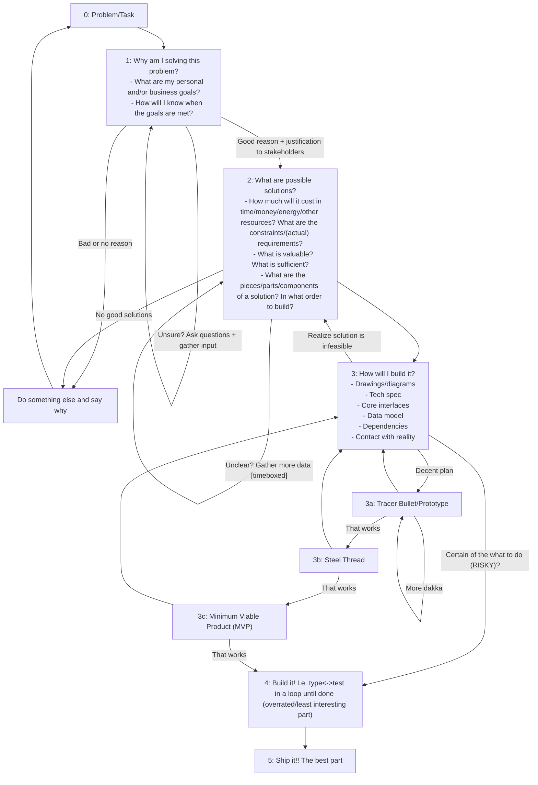

## Flowchart

```mermaid
graph TD
    PT["0: Problem/Task"]-->WHY
    WHY["1: Why am I solving this problem?
    - What are my personal and/or business goals?
    - How will I know when the goals are met?"]--Good reason + justification to stakeholders-->WHAT
    WHY--"Bad or no reason"-->X
    WHY--"Unsure? Ask questions + gather input"-->WHY
    WHAT["2: What are possible solutions?
    - How much will it cost in time/money/energy/other resources? What are the constraints/(actual) requirements?
    - What is valuable? What is sufficient?
    - What are the pieces/parts/components of a solution? In what order to build?"]-->HOW
    WHAT--"Lost in the sauce? Recall why"-->WHAT
    WHAT--"No good solutions"-->X
    WHAT--"Unclear? Gather more data [timeboxed]"-->WHAT
    HOW["3: How will I build it?
    - Drawings/diagrams
    - Tech spec
    - Core interfaces
    - Data model
    - Dependencies
    - Contact with reality"]
    HOW--"Certain of the what to do (RISKY)?"-->BUILD
    HOW--"Decent plan"-->TB
    HOW--"Realize solution is infeasible"-->WHAT
    TB["3a: Tracer Bullet/Prototype"]--"More dakka"-->TB
    TB-->HOW
    TB--"That works"-->ST
    ST["3b: Steel Thread"]--"That works"-->MVP
    ST-->HOW
    MVP["3c: Minimum Viable Product (MVP)"]--"That works"-->BUILD
    MVP-->HOW
    BUILD["4: Build it! I.e. type<->test in a loop until done (overrated/least interesting part)"]-->SHIP
    SHIP["5: Ship it!! The best part"]
    X["Do something else and say why"]-->PT
```