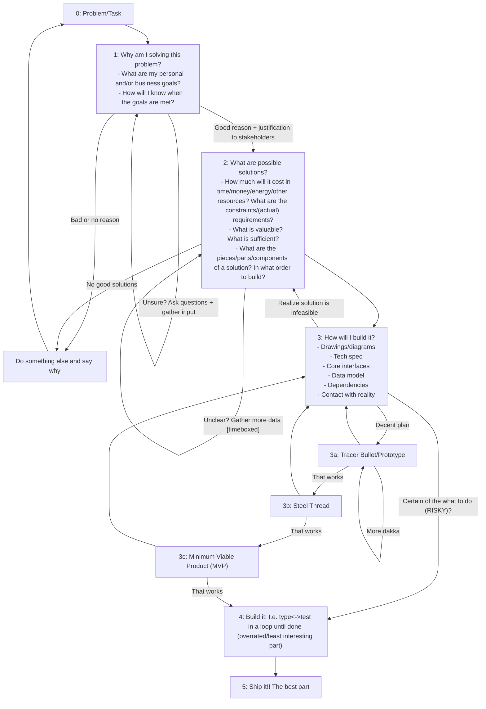

# Prioritization and Uncertainty

- Uncertainty and ambiguity are inevitable and what you are **paid** to resolve **quickly** and **sufficiently** (i.e. to meet the objectives/requirements).
    - The ideal state is to know exactly what to build and to do it perfectly on the first try, but this is impossible. Perfectionism BAD.
    - A guaranteed hour now is worth more than the promise of an hour later. So what do we do with our now-r? Priorities tell us. But where do they come from? Ultimately, contact with reality, but there is always ambiguity/incomplete information.
- Types of Ambiguity
    - How to build
        - Often easy these days due to AI + Internet
        - Can be a trap because what if you build the wrong thing? Which leads to...
        - Subverted by "do you even need to build?"
    - What to build
        - Hard/impossible, nebulous.
        - AI doesn't know, boss doesn't necessarily know, even customers don't know, you definitely don't know.
            - If you know, you can get many $$$, just ask Parth
        - Related problems
            - Do you even need to build?
                - What existing solutions are available?
                - What out there is similar to what you want?
                - The best code is no code: can I solve without writing any code?
            - In what order to build?
                - What is the most ambiguous part?
                - Monkeys vs. Pedestals
                - Checkpoints/milestones in what you're building
                    - Can you hand your work in progress off to someone else?
                    - Can you split the work up and do it in parallel?
            - How to know when you're done building?
                - What does "good" look like? What would be good outcomes? What is valued? What is important? What can be left out?
                - Why am I doing this? Does this actually accomplish the objective? How can you know?
                    - "My manager said so" is a bad reason (imagine you're a solopreneur i.e. your own manager).
                        - If "my manager/team/company said so", you should be able to unpack it into something that you believe concretely produces value.
                        - "Believe" because there are limitations to what we can know about reality. E.g. your company may construct its strategy based on analysis/market research/running experiments/etc. all of which are flawed in some way.
                    - "Creates business/personal value" is a good reason, but still have to understand your value system.
                        - Personal value: "I want to learn this technology." "I think it's cool."

## Flowchart

